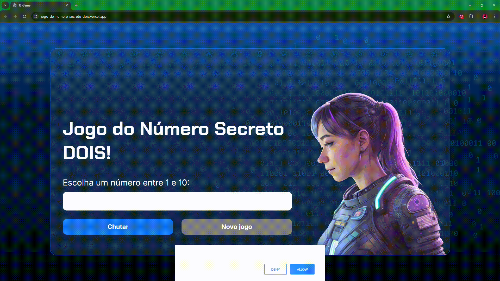

# 🎰 Jogo do Número Secreto 2.0

## 📰 Descrição

Segundo projeto do **"Jogo do Número Secreto"**, desenvolvido durante o segundo curso de Lógica de Programação da plataforma da Alura.

Esse projeto apresenta, assim como a versão anterior, um jogo que você deve descobrir o "número secreto", mas com **novas atualizações: visual completamente refeito, botões para "chutar" um número e, ao acertar, criar um novo jogo, utilização de uma inteligência para narrar os textos...**

> Além do "revamp" no visual, também há no **código: novas formas de evitar repetição no código, utilização e declaração de Funções e Arrays, utilização do "DOM" (Document Object Model), utilização do "Math.random" (função que pega um número aleatório)...**

## 🔗 Link para vizualização

## 💻 Tecnologias Utilizadas
`Trabalhado durante o curso:`

 

`Desenvolvido anteriormente pela Alura:`

 

## 🏅 Certificado de Conclusão 

## 🙋 Autores
[    Gabriel Possato ](https://github.com/possatogabriel)
 
 

    

